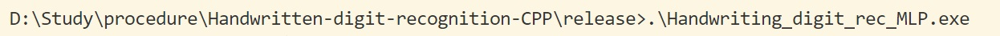
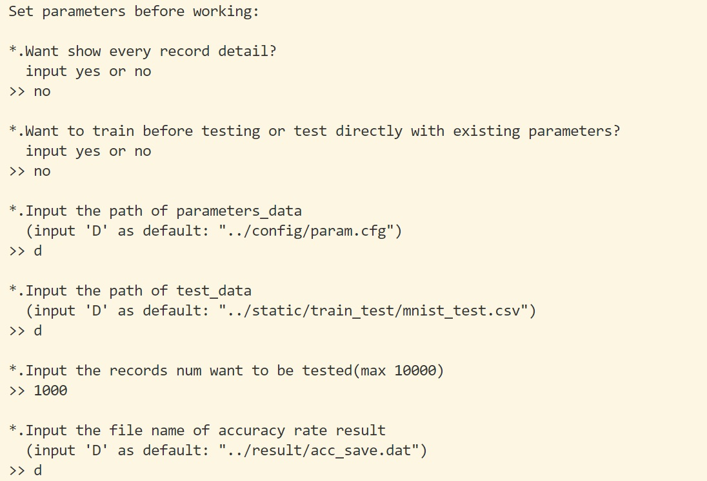
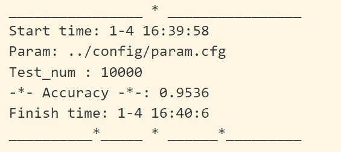

# 目录

[手写体数字识别(c++)](#手写体数字识别(c++))

- [概况](#概况)
- [数据结构](#数据结构)
- [算法推导](#算法推导)
  - [随机梯度下降](#随机梯度下降)
  - [反向传播算法](#反向传播算法)
- [训练测试数据](#训练测试数据)
- [文件目录](#文件目录)
- [测试方法](#测试方法)
- [测试结果](#测试结果)
- [项目参与](#项目参与)
  - [说明](#说明)
  - [超参数](#超参数)
  - [输入预处理](#输入预处理)

---

# 手写体数字识别(c++)

>  深度学习的"hello world!"
>
>  2019-01-03

## 概况

本项目利用全连接神经网络对手写体数字进行训练与识别。

- 训练与测试均采用MNIST数据集。
- 采用全连接神经网络，相关超参数存储在`.\config\hyparam.cfg`下

> - hl_num 隐藏层数
> - hl_nodes_num 隐藏层结点数
> - rate 学习速率

- 相关算法:

> - 随机梯度下降
> - 反向传播算法

如果不关注实现方法和算法细节，可以直接跳转至测试方法：[测试方法](#测试方法)


## 数据结构

待补


## 算法推导

### 随机梯度下降

待补

[参考内容](https://www.zybuluo.com/hanbingtao/note/448086)

### 反向传播算法

待补

[参考内容](https://www.zybuluo.com/hanbingtao/note/476663)

## 训练测试数据

**MNIST数据集** [下载地址](http://yann.lecun.com/exdb/mnist/)

>The **MNIST database** (Modified [National Institute of Standards and Technology](https://en.wikipedia.org/wiki/National_Institute_of_Standards_and_Technology) database) is a large [database](https://en.wikipedia.org/wiki/Database) of handwritten digits that is commonly used for [training](https://en.wikipedia.org/wiki/Training_set) various [image processing](https://en.wikipedia.org/wiki/Image_processing)systems. The database is also widely used for training and testing in the field of [machine learning](https://en.wikipedia.org/wiki/Machine_learning).[[3\]](https://en.wikipedia.org/wiki/MNIST_database#cite_note-3)[[4\]](https://en.wikipedia.org/wiki/MNIST_database#cite_note-4) It was created by "re-mixing" the samples from [NIST's original datasets](https://www.nist.gov/srd/upload/nistsd19.pdf). The creators felt that since NIST's training dataset was taken from American [Census Bureau](https://en.wikipedia.org/wiki/United_States_Census_Bureau) employees, while the testing dataset was taken from [American](https://en.wikipedia.org/wiki/Americans) [high school](https://en.wikipedia.org/wiki/High_school) students, it was not well-suited for machine learning experiments. Furthermore, the black and white images from NIST were [normalized](https://en.wikipedia.org/wiki/Normalization_(image_processing)) to fit into a 28x28 pixel bounding box and [anti-aliased](https://en.wikipedia.org/wiki/Spatial_anti-aliasing), which introduced grayscale levels.
>
>—— From Wikipedia

MNIST数据集不能直接使用，用脚本对原始数据处理，得到两份*.csv文件。

> 训练数据: `mnist_train.csv` 60000组
>
> 测试数据: `minist_test.csv` 10000组

每组数据包含<a href="https://www.codecogs.com/eqnedit.php?latex=\inline&space;28\times28&space;&plus;&space;1=785" target="_blank"></a>项:

- 第1项，数据标签label，取值[0,9]。

- 其余784项是图片每个像素的灰度，取值[0,255]。

## 文件目录

```
.
├── bin
|    ├── MNIST.zip         # MNIST原始数据集
|    └── convert.py        # py2脚本，可将MNIST原始数据集转化为*.csv格式 (使用时修改路径)
├── config
|    ├── hyparam.cfg       # 超参数配置
|    └── param.cfg         # 训练参数配置(可重新训练)
├── img
|    ├── frame.jpg         # 展示图1
|    ├── release.jpg       # 效果图1
|    └── param_set.jpg     # 效果图2
├── params                 # 参与者贡献的数据文件集合
|    ├── ...
|    └── A_B_C.zip         # A:参与者姓名   B:隐藏层数   C:隐藏层结点数
|         ├── hyparam.cfg  # 该测试所用的超参数配置
|         ├── param.cfg    # 训练得到的参数配置
|         └── README.txt   # 此次测试的简单说明(包括训练组数，测试组数，准确率以及对源码的改进等)
├── release
|    └── Handwriting_digit_rec_MLP.exe    # 可执行程序
├── result
|    └── acc_save.dat      # 测试的结果保存文件(默认) 
├── src
|    ├── Assistant.cpp     # 训练助手类实现
|    ├── Assistant.h       # 训练助手类定义
|    ├── Data_fetch.cpp    # 数据获取类实现
|    ├── Data_fetch.h      # 数据获取类定义
|    ├── MLP_Neural_Network.cpp  # 多层全连接神经网络类实现
|    ├── MLP_Neural_Network.h    # 多层全连接神经网络类定义
|    └── demo.cpp          # 主函数入口，效果展示
├── static
|    └── train_test.zip    # 训练和测试数据(*.csv)，使用时解压
└── README.md              # 说明文档
```


## 测试方法

该流程仅作演示。

> - 测试环境：windows 10
>
> - 命令行： `cmd`
>
> - 超参数配置: `.\config\hyparam.cfg`
>
>   > 隐藏层数目: 1
>   >
>   > 隐藏层结点: 300
>   >
>   > 学习速率: 0.35
>
> - 训练参数配置: `.\config\param.cfg`
>
>   > 训练`.\static\train_test\mnist_train.csv` 60000组得到
>
> - 测试结果：测试结果默认保存在`.\result\acc_save.dat`中，在之前的测试结果后追加

1. 命令行当前在`release`目录即`.\release\`下。

2. `.\Handwriting_digit_rec_MLP.exe`运行程序

   

3. 进行多个参数设置，其中:

> 1. *.Want show every record detail?
>
>    是否显示每组数据的测试结果？
>
> 2. *.Want to train before testing or test directly with existing parameters?
>
>    输入yes，选择重新训练一组新的参数用于测试
>
>    输入no，选择直接用现有的参数进行测试
>
> 3. *.Input the path of train_data
>
>    输入用于**训练**的数据文件路径<输入'D'默认为`../static/train_test/mnist_train.csv`>(问题2 回答yes后出现)
>
> 4. *.Input the records num want to be trained(max 60000)
>
>    输入训练的数据组数，最大为60000(问题2 回答yes后出现)
>
> 5. *.Input the file name of trained parameters
>
>    输入用于保存训练后得到的参数的文件路径<输入'D'默认为`../config/param.cfg`>(问题2 回答yes后出现)
>
> 6. *.Input the path of parameters_data
>
>    输入现有的参数文件路径<输入'D'默认为`../config/param.cfg`>(问题2 回答no后出现)
>
> 7. *.Input the path of test_data
>
>    输入用于**测试**的数据文件路径<输入'D'默认为`./static/train_test/mnist_test.csv`>
>
> 8. *.Input the records num want to be tested(max 10000)
>
>    输入测试的数据组数，最大为10000
>
> 9. *.Input the file name of accuracy rate result
>
>    输入存放测试结果的文件路径<输入'D'默认为`../result/acc_save.dat`>

**这里演示一种情况，这使用默认路径下的`param.cfg`，见下图**



> - 不显示每组数据的测试结果
> - 选择现有的训练参数进行测试
> - 训练参数在默认路径: `../config/param.cfg`
> - 测试数据在默认路径: `../static/train_test/mnist_test.csv`
> - 测试数据1000组
> - 测试结果保存在默认路径: `.\result\acc_save.dat`中


## 测试结果

上一部分演示的结果为:



其中每部分:

> - Start time: mon-day hour:min:sec   # 程序开始的本地时间
> - Param: ../config/param.cfg         # 训练参数的路径
> - Test_num: 1000                     # 测试组数
> - Accuarcy 0.941                     # 识别准确率 (94.1%)
> - Finish time: mon-day hour:min:sec  # 程序结束的本地时间 

可把`.\params\`中的压缩包解压，其中`param.cfg`和`hyparam.cfg`复制到`.\config\`中作为新配置文件进行测试。

>  一般测试数据组数应大于1000。


## 项目参与

### 说明

除了仅用该程序做测试，还可以通过改变超参数或输入数据预处理算法来贡献新的参数配置。


### 超参数

- `rate`学习速率

  位置：  "MLP_Neural_Network.h" >row 21

  初始值: 0.35

  调整建议: 

  学习速率太大容易过优化，太小训练速度慢容易陷入局部极值。

  可以适当调小，或采用动态更新的办法，每次训练根据代价函数的值更新。

- `hl_num`隐藏层层数

  位置:	"MLP_Neural_Network.h" >row 22

  初始值: 1

  调整建议:

  由于输入层到输出层为784维到10维的映射，隐藏层数不宜过多。

  可以适当增大隐藏层层数，根据以往测试`hl_num`的变化对训练速度的影响比`hl_nodes_num`小。

- `hl_nodes_num`隐藏层的维度

  位置:	"MLP_Neural_Network.h" >row 25

  初始值:  300

  调整建议:

  隐藏层的维度对训练速度的影响很大，可以适当减小。

  对隐藏层维度即隐藏层结点个数的取值有以下*经验公式*:

  <a href="https://www.codecogs.com/eqnedit.php?latex=\inline&space;m&space;=&space;\sqrt{n&plus;l}&plus;\alpha" target="_blank"></a>

  <a href="https://www.codecogs.com/eqnedit.php?latex=\inline&space;m=\log_2{n}" target="_blank"></a>

  <a href="https://www.codecogs.com/eqnedit.php?latex=\inline&space;m=\sqrt{nl}" target="_blank"></a>

  其中:

  m: 隐藏层结点数

  n: 输入层结点数

  l: 输出层结点数

  <a href="https://www.codecogs.com/eqnedit.php?latex=\inline&space;\alpha&space;\in&space;[1,&space;10]" target="_blank"></a>

  > ps: 由于程序设计的问题，所有隐藏层的维度都将是`hl_nodes_num`，如果有需要可以改进为不同隐藏层的维度不同。	 

### 输入预处理

由于输入层元素大小在0到255之间不利于训练，需要进行预处理。

- 预处理函数: `inline void Network::input_prep(std::vector<double> &)`

- 函数实现位置: "MLP_Neural_Network.cpp" >row 285

- 预览:

  ```c++
  /**
   * @Brief  Preprocessing 784-dimensional vector input_layer
   * @Date   2019-01-04
   * @Param  inputs: the vector<double> of input value, sizeof(inputs) == 28 * 28
   *                 values in inputs are guaranteed to [0, MAX_VALUE]
   *                 with MAX_VALUE defined as (1 << 8) - 1 at "MLP_Neural_Network.h"
   *
   * @Author    Herixth
   * @Algorithm 
   *        // Write down specific processing algorithms:
   *        For each element E in inputs
   *        > if E > (MAX_VALUE >> 1)
   *              E = 1.0
   *        > else
   *              E = 0.0
            So the input_layer can be treated as a zero-one matrix
   */
  inline void Network::input_prep(std::vector<double> &inputs) {
      std::vector<double>::iterator iter = inputs.begin();
      for (; iter != inputs.end(); iter++) {
          (*iter) = ((*iter) > (MAX_VALUE >> 1));
      }
  }
  ```

- 调整建议:

  该方法将输入进行二值化离散处理，可以考虑多分几种情况，把离散的程度更加连续。