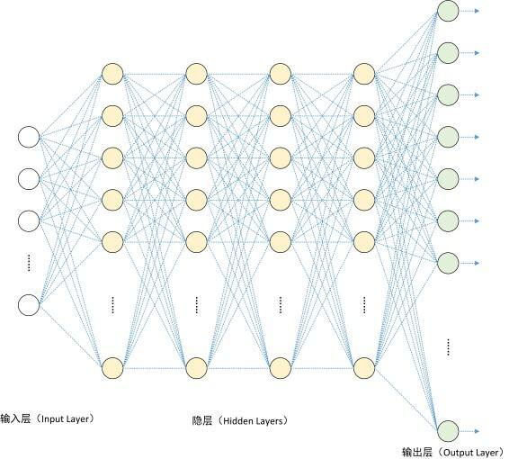
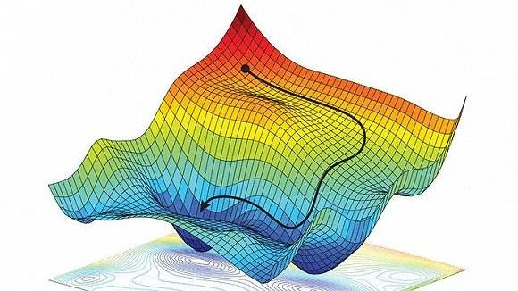
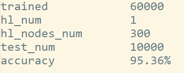

# 目录

[手写体数字识别(c++)](#手写体数字识别(c++))

- [概况](#概况)
- [数据结构](#数据结构)
- [算法推导](#算法推导)
  - [变量声明](#变量声明)
  - [正向传播](#正向传播)
  - [随机梯度下降](#随机梯度下降)
  - [反向传播算法](#反向传播算法)
- [训练测试数据](#训练测试数据)
- [文件目录](#文件目录)
- [测试方法](#测试方法)
- [测试结果](#测试结果)
- [项目参与](#项目参与)
  - [说明](#说明)
  - [超参数](#超参数)
  - [输入预处理](#输入预处理)
- [总结](#总结)

---

# 手写体数字识别(c++)

>  深度学习的"hello world!"
>
>  2019-01-03

## 概况

本项目利用全连接神经网络对手写体数字进行训练与识别。

- 训练与测试均采用MNIST数据集。
- 采用全连接神经网络，相关超参数存储在`.\config\hyparam.cfg`下

> - hl_num 隐藏层数
> - hl_nodes_num 隐藏层结点数
> - rate 学习速率

- 相关算法:

> - 随机梯度下降
> - 反向传播算法

如果不关注实现方法和算法细节，可以直接跳转至测试方法：[测试方法](#测试方法)


## 数据结构



待补

## 算法推导

### 变量声明

- 输入数据: <a href="https://www.codecogs.com/eqnedit.php?latex=\inline&space;({X},{T})" target="_blank"></a>

  > 其中
  >
  > <a href="https://www.codecogs.com/eqnedit.php?latex={X}=\begin{bmatrix}&space;x_0&space;\\&space;x_1&space;\\&space;\cdots&space;\\&space;x_i&space;\\&space;\cdots&space;\\&space;x_{783}&space;\\&space;1&space;\end{bmatrix}" target="_blank"></a></a>为输入层， <a href="https://www.codecogs.com/eqnedit.php?latex={T}=\begin{bmatrix}&space;t_0&space;\\&space;t_1&space;\\&space;\cdots&space;\\&space;t_i&space;\\&space;\cdots&space;\\&space;t_{9}&space;\end{bmatrix}" target="_blank"></a>为标签
  >
  > 且
  >
  > <a href="https://www.codecogs.com/eqnedit.php?latex=\exists&space;i&space;\in[0,&space;783]&space;\rightarrow&space;x_i&space;\in{\mathbb{N}}&space;\wedge&space;x_i&space;\in&space;[0,&space;255]" target="_blank"></a>
  >
  > <a href="https://www.codecogs.com/eqnedit.php?latex=\exists&space;i&space;\in[0,&space;9]&space;\rightarrow&space;t_i&space;\in&space;\{0,&space;1\}" target="_blank"></a>
  >
  > <a href="https://www.codecogs.com/eqnedit.php?latex=\inline&space;X" target="_blank"></a>的最后一项恒为1，为了匹配<a href="https://www.codecogs.com/eqnedit.php?latex=\inline&space;W" target="_blank"></a>中的偏置项<a href="https://www.codecogs.com/eqnedit.php?latex=\inline&space;w_{ib}" target="_blank"></a>
  >
  > 除了最后一层即输出层之外，其他层的最后一项恒为1

- 输出数据: <a href="https://www.codecogs.com/eqnedit.php?latex=\inline&space;Y" target="_blank"></a>

  > <a href="https://www.codecogs.com/eqnedit.php?latex={Y}&space;=&space;\begin{bmatrix}&space;y_0\\&space;y_1\\&space;\cdots\\&space;y_i&space;\\&space;\cdots&space;\\&space;y_9&space;\end{bmatrix}" target="_blank"></a>
  >
  > 且
  >
  > <a href="https://www.codecogs.com/eqnedit.php?latex=\exists&space;i&space;\in&space;[0,&space;9]&space;\rightarrow&space;y_i&space;\in&space;\mathbb{Q}&space;\wedge&space;y_i&space;\in&space;(0,&space;1)" target="_blank"></a>

- 隐藏层: <a href="https://www.codecogs.com/eqnedit.php?latex=\inline&space;A" target="_blank"></a>

  > 其中
  >
  > <a href="https://www.codecogs.com/eqnedit.php?latex={A}=\begin{bmatrix}&space;a_0&space;\\&space;a_1&space;\\&space;\cdots&space;\\&space;a_i&space;\\&space;\cdots&space;\\&space;a_{hl\_nodes\_num&space;-1}&space;\\&space;1&space;\end{bmatrix}" target="_blank"></a>
  >
  > 且
  >
  > <a href="https://www.codecogs.com/eqnedit.php?latex=\exists&space;i&space;\in&space;[0,&space;hl\_nodes\_num&space;-&space;1]&space;\rightarrow&space;a_i&space;\in&space;\mathbb{Q}&space;\wedge&space;a_i&space;\in&space;(0,&space;1)" target="_blank"></a>

- 边值权重: <a href="https://www.codecogs.com/eqnedit.php?latex=\inline&space;W" target="_blank"></a>

  > 其中
  >
  > <a href="https://www.codecogs.com/eqnedit.php?latex=W&space;=&space;\begin{bmatrix}&space;w_{00}&space;&&space;w_{01}&space;&&space;\cdots&space;&&space;w_{0n}&space;&&space;w_{0b}&space;\\&space;w_{10}&space;&&space;w_{11}&&space;\cdots&space;&&space;w_{1n}&space;&&space;w_{1b}\\&space;\vdots&space;&&space;\vdots&space;&&space;\ddots&space;&&space;\vdots&space;&&space;\vdots\\&space;w_{m0}&space;&&space;w_{m_1}&space;&&space;\cdots&space;&&space;w_{mn}&space;&&space;w_{mb}&space;\\&space;\end{bmatrix}" target="_blank"></a>
  >
  > <a href="https://www.codecogs.com/eqnedit.php?latex=\inline&space;w_{ji}" target="_blank"></a>表示前一层的结点i连接下一层的结点j的权重
  >
  > n 表示前一层结点的个数-1(不算最后恒定的1)
  >
  > m 表示后一层结点的个数-1(不算最后恒定的1)
  >
  > [](https://www.codecogs.com/eqnedit.php?latex=\inline&space;w_{ib}) 为偏置项，用来完成感知器中的偏执操作

- 代价函数: <a href="https://www.codecogs.com/eqnedit.php?latex=\inline&space;E_d&space;=&space;\frac{1}{2}\sum_{i\in&space;outputs}{(t_i&space;-&space;y_i)^2}" target="_blank"></a>

- 激活函数: <a href="https://www.codecogs.com/eqnedit.php?latex=\inline&space;sigmoid(x)=\frac{1}{1&plus;e^{-x}}" target="_blank"></a>

- 学习速率: <a href="https://www.codecogs.com/eqnedit.php?latex=\eta" target="_blank"></a>

- 结点误差: <a href="https://www.codecogs.com/eqnedit.php?latex=\delta_i" target="_blank"></a>

- 隐藏层数: hl_num

- 隐藏层结点数: hl_nodes_num

### 正向传播

<a href="https://www.codecogs.com/eqnedit.php?latex={A_0}&space;=&space;sigmoid({W_0}&space;\cdot&space;{X})" target="_blank"></a>

<a href="https://www.codecogs.com/eqnedit.php?latex={A_1}&space;=&space;sigmoid({W_1}&space;\cdot&space;{A_0})" target="_blank"></a>

...

<a href="https://www.codecogs.com/eqnedit.php?latex={A_{hl\_num&space;-&space;1}}&space;=&space;sigmoid({W_{hl\_num&space;-&space;1}}&space;\cdot&space;{A_{hl\_num&space;-&space;2}})" target="_blank"></a>

### <a href="https://www.codecogs.com/eqnedit.php?latex={Y}&space;=&space;sigmoid({W_{hl\_num}}&space;\cdot&space;{A_{hl\_num&space;-&space;1}})" target="_blank"></a>

### 随机梯度下降

采用随机梯度下降算法优化训练时间，并且可以有效逃离多元函数局部极小值。

由于<a href="https://www.codecogs.com/eqnedit.php?latex=\inline&space;E_d&space;=&space;\frac{1}{2}\sum_{i\in&space;outputs}{(t_i&space;-&space;y_i)^2}" target="_blank"></a>是输出数据<a href="https://www.codecogs.com/eqnedit.php?latex=y_i" target="_blank"></a>的直接函数，故可将<a href="https://www.codecogs.com/eqnedit.php?latex=E_d" target="_blank"></a>看作所有<a href="https://www.codecogs.com/eqnedit.php?latex=w_{ji}" target="_blank"></a>的多元函数。

在某一<a href="https://www.codecogs.com/eqnedit.php?latex=w_{ji}" target="_blank"></a>维度下求该函数梯度的负值即<a href="https://www.codecogs.com/eqnedit.php?latex=w_{ji}" target="_blank"></a>的调整方向。

如图:



故针对某一边值权重进行更新的方法为:

<a href="https://www.codecogs.com/eqnedit.php?latex=w_{ji}\leftarrow&space;w_{ji}-\eta\cdot&space;\frac{\partial&space;E_d}{\partial&space;w_{ji}}" target="_blank"></a>

[参考内容](https://www.zybuluo.com/hanbingtao/note/448086)

### 反向传播算法

在随机梯度下降的基础上，每次训练更新所有边值权重，即关键点是求<a href="https://www.codecogs.com/eqnedit.php?latex=\inline&space;\frac{\partial&space;E_d}{\partial&space;w_{ji}}" target="_blank"></a>

> 设<a href="https://www.codecogs.com/eqnedit.php?latex=net_j&space;=&space;\vec{w_{j*}}&space;\cdot&space;\vec{x_{j*}}&space;=&space;\sum_i{w_{ji}\cdot&space;x_{ji}}" target="_blank"></a>

则 <a href="https://www.codecogs.com/eqnedit.php?latex=\frac{\partial&space;E_d}{\partial&space;w_{ji}}=&space;\frac{\partial&space;E_d}{\partial&space;net_j}&space;\cdot&space;\frac{\partial&space;net_j}{\partial&space;w_{ji}}" target="_blank"></a>


待补

[参考内容](https://www.zybuluo.com/hanbingtao/note/476663)

## 训练测试数据

**MNIST数据集** [下载地址](http://yann.lecun.com/exdb/mnist/)

>The **MNIST database** (Modified [National Institute of Standards and Technology](https://en.wikipedia.org/wiki/National_Institute_of_Standards_and_Technology) database) is a large [database](https://en.wikipedia.org/wiki/Database) of handwritten digits that is commonly used for [training](https://en.wikipedia.org/wiki/Training_set) various [image processing](https://en.wikipedia.org/wiki/Image_processing)systems. The database is also widely used for training and testing in the field of [machine learning](https://en.wikipedia.org/wiki/Machine_learning).[[3\]](https://en.wikipedia.org/wiki/MNIST_database#cite_note-3)[[4\]](https://en.wikipedia.org/wiki/MNIST_database#cite_note-4) It was created by "re-mixing" the samples from [NIST's original datasets](https://www.nist.gov/srd/upload/nistsd19.pdf). The creators felt that since NIST's training dataset was taken from American [Census Bureau](https://en.wikipedia.org/wiki/United_States_Census_Bureau) employees, while the testing dataset was taken from [American](https://en.wikipedia.org/wiki/Americans) [high school](https://en.wikipedia.org/wiki/High_school) students, it was not well-suited for machine learning experiments. Furthermore, the black and white images from NIST were [normalized](https://en.wikipedia.org/wiki/Normalization_(image_processing)) to fit into a 28x28 pixel bounding box and [anti-aliased](https://en.wikipedia.org/wiki/Spatial_anti-aliasing), which introduced grayscale levels.
>
>—— From Wikipedia

MNIST数据集不能直接使用，用脚本对原始数据处理，得到两份*.csv文件。

> 训练数据: `mnist_train.csv` 60000组
>
> 测试数据: `minist_test.csv` 10000组

每组数据包含<a href="https://www.codecogs.com/eqnedit.php?latex=\inline&space;28\times28&space;&plus;&space;1=785" target="_blank"></a>项:

- 第1项，数据标签label，取值[0,9]。

- 其余784项是图片每个像素的灰度，取值[0,255]。

## 文件目录

```
.
├── bin
|    ├── MNIST.zip         # MNIST原始数据集
|    └── convert.py        # py2脚本，可将MNIST原始数据集转化为*.csv格式 (使用时修改路径)
├── config
|    ├── hyparam.cfg       # 超参数配置
|    └── param.cfg         # 训练参数配置(可重新训练)
├── img
|    ├── frame.jpeg        # 展示图1
|    ├── release.jpg       # 效果图1
|    ├── ...               # 效果图2
|    └── show.jpg          # 展示图2
├── params                 # 参与者贡献的数据文件集合
|    ├── ...
|    └── A_B_C.zip         # A:参与者ID   B:隐藏层数   C:隐藏层结点数
|         ├── hyparam.cfg  # 该测试所用的超参数配置
|         ├── param.cfg    # 训练得到的参数配置
|         └── README.txt   # 此次测试的简单说明(包括训练组数，测试组数，准确率以及对源码的改进等)
├── release
|    └── Handwriting_digit_rec_MLP.exe    # 可执行程序
├── result
|    └── acc_save.dat      # 测试的结果保存文件(默认) 
├── src
|    ├── Assistant.cpp     # 训练助手类实现
|    ├── Assistant.h       # 训练助手类定义
|    ├── Data_fetch.cpp    # 数据获取类实现
|    ├── Data_fetch.h      # 数据获取类定义
|    ├── MLP_Neural_Network.cpp  # 多层全连接神经网络类实现
|    ├── MLP_Neural_Network.h    # 多层全连接神经网络类定义
|    └── demo.cpp          # 主函数入口，效果展示
├── static
|    └── train_test.zip    # 训练和测试数据(*.csv)，使用时解压
└── README.md              # 说明文档
```


## 测试方法

该流程仅作演示。

> - 测试环境：windows 10
>
> - 命令行： `cmd`
>
> - 超参数配置: `.\config\hyparam.cfg`（预置)
>
>   > 隐藏层数目: 1
>   >
>   > 隐藏层结点: 300
>   >
>   > 学习速率: 0.35
>
> - 训练参数配置: `.\config\param.cfg`(默认)
>
>   > 训练`.\static\train_test\mnist_train.csv` 60000组得到
>
> - 测试结果：测试结果默认保存在`.\result\acc_save.dat`中，在之前的测试结果后追加

1. 命令行当前在`release`目录即`.\release\`下。

2. `.\Handwriting_digit_rec_MLP.exe`运行程序

   

3. 进行多个参数设置，其中:

> 1. *.Want show every record detail?
>
>    是否显示每组数据的测试结果？
>
> 2. *.Want to train before testing or test directly with existing parameters?
>
>    输入yes，选择重新训练一组新的参数用于测试
>
>    输入no，选择直接用现有的参数进行测试
>
> 3. *.Input the path of train_data
>
>    输入用于**训练**的数据文件路径<输入'D'默认为`../static/train_test/mnist_train.csv`>(问题2 回答yes后出现)
>
> 4. *.Input the records num want to be trained(max 60000)
>
>    输入训练的数据组数，最大为60000(问题2 回答yes后出现)
>
> 5. *.Input the file name of trained parameters
>
>    输入用于保存训练后得到的参数的文件路径<输入'D'默认为`../config/param.cfg`>(问题2 回答yes后出现)
>
> 6. *.Input the path of parameters_data
>
>    输入现有的参数文件路径<输入'D'默认为`../config/param.cfg`>(问题2 回答no后出现)
>
> 7. *.Input the path of test_data
>
>    输入用于**测试**的数据文件路径<输入'D'默认为`../static/train_test/mnist_test.csv`>
>
> 8. *.Input the records num want to be tested(max 10000)
>
>    输入测试的数据组数，最大为10000
>
> 9. *.Input the file name of accuracy rate result
>
>    输入存放测试结果的文件路径<输入'D'默认为`../result/acc_save.dat`>

**这里演示一种情况，这使用默认路径下的`param.cfg`，见下图**


> - 不显示每组数据的测试结果
> - 选择现有的训练参数进行测试
> - 训练参数在默认路径: `../config/param.cfg`
> - 测试数据在默认路径: `../static/train_test/mnist_test.csv`
> - 测试数据10000组
> - 测试结果保存在默认路径: `../result/acc_save.dat`中


## 测试结果

上一部分演示的结果为:


其中每部分:

> - Start time: mon-day hour:min:sec   # 程序开始的本地时间
> - Param: ../config/param.cfg         # 训练参数的路径
> - Test_num: 10000                    # 测试组数
> - Accuracy 0.9536                    # 识别准确率 (95.36%)
> - Finish time: mon-day hour:min:sec  # 程序结束的本地时间 

可把`.\params\`中的压缩包解压，其中`param.cfg`和`hyparam.cfg`复制到`.\config\`中作为新配置文件进行测试。

>  一般测试数据组数应尽量大(10000)。

## 项目参与

### 说明

除了仅用该程序做测试，还可以通过改变超参数或输入数据预处理算法来贡献新的训练参数配置。

1. 更改`.\config\hyparam.cfg`中的超参数配置 (详情见[超参数](#超参数))

2. 如果有必要，更改输入数据预处理算法 (详情见[输入预处理](#输入预处理))

3. 训练一组新的`param.cfg`，并且对该训练参数配置进行测试，测试数据数目应为10000(测完)

4. 训练测试之后进行打包，规则如下:
   > - 撰写说明文档`README.txt`，内容如下
   >
   >   
   >
   > - 将训练得到的`param.cfg`，所用超参数配置`hyparam.cfg`，以及说明文档`README.txt`放入同一文件夹，并压缩成压缩文件。
   >
   > - 该文件夹命名为 "昵称ID_隐藏层数目\_隐藏层结点数"。
   >
   > - 放入`.\params\`目录下上传

### 超参数

在`hyparam.cfg`文件中需要设置3种配置，如下:

- `rate`学习速率

  示例值: 0.35

  调整建议: 

  学习速率太大容易过优化，太小训练速度慢容易陷入局部极值。

  可以适当调小，或采用动态更新的办法，每次训练根据代价函数的值更新。

- `hl_num`隐藏层层数

  示例值: 1

  调整建议:

  由于输入层到输出层为784维到10维的映射，隐藏层数不宜过多。

  可以适当增大隐藏层层数，根据以往测试`hl_num`的变化对训练速度的影响比`hl_nodes_num`小。

- `hl_nodes_num`隐藏层的维度

  示例值: 300

  调整建议:

  隐藏层的维度对训练速度的影响很大，可以适当减小。

  对隐藏层维度即隐藏层结点个数的取值有以下*经验公式*:

  <a href="https://www.codecogs.com/eqnedit.php?latex=\inline&space;m&space;=&space;\sqrt{n&plus;l}&plus;\alpha" target="_blank"></a>

  <a href="https://www.codecogs.com/eqnedit.php?latex=\inline&space;m=\log_2{n}" target="_blank"></a>

  <a href="https://www.codecogs.com/eqnedit.php?latex=\inline&space;m=\sqrt{nl}" target="_blank"></a>

  其中:

  m: 隐藏层结点数

  n: 输入层结点数

  l: 输出层结点数

  <a href="https://www.codecogs.com/eqnedit.php?latex=\inline&space;\alpha&space;\in&space;[1,&space;10]" target="_blank"></a>

  > PS: 由于程序设计的问题，所有隐藏层的维度都将是`hl_nodes_num`，如果有需要可以改进为不同隐藏层的维度不同。	 

### 输入预处理

由于输入层元素大小在0到255之间不利于训练，需要进行预处理。

- 预处理函数: `inline void Network::input_prep(std::vector<double> &)`

- 函数实现位置: "MLP_Neural_Network.cpp" >row 300+

- 预览:

  ```c++
  /**
   * @Brief  Preprocessing 784-dimensional vector input_layer
   * @Date   2019-01-04
   * @Param  inputs: the vector<double> of input value, sizeof(inputs) == 28 * 28
   *                 values in inputs are guaranteed to [0, MAX_VALUE]
   *                 with MAX_VALUE defined as (1 << 8) - 1 at "MLP_Neural_Network.h"
   *
   * @Author Herixth
   * @Algorithm 
   *        // Write down specific processing algorithms:
   *        For each element E in inputs
   *        > if E > (MAX_VALUE >> 1)
   *              E = 1.0
   *        > else
   *              E = 0.0
            So the input_layer can be treated as a zero-one matrix
   */
  inline void Network::input_prep(std::vector<double> &inputs) {
      std::vector<double>::iterator iter = inputs.begin();
      for (; iter != inputs.end(); iter++) {
          (*iter) = ((*iter) > (MAX_VALUE >> 1));
      }
  }
  ```

- 调整建议:

  该方法将输入进行二值化离散处理，可以考虑多分几种情况，把离散的程度更加连续。

## 总结

全连接神经网络还有很多需要优化的地方，以后继续写，将来可能需要用别的模型来优化。